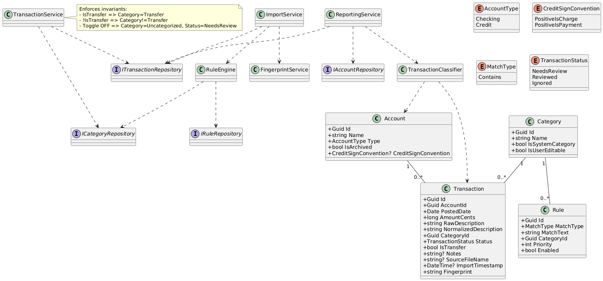
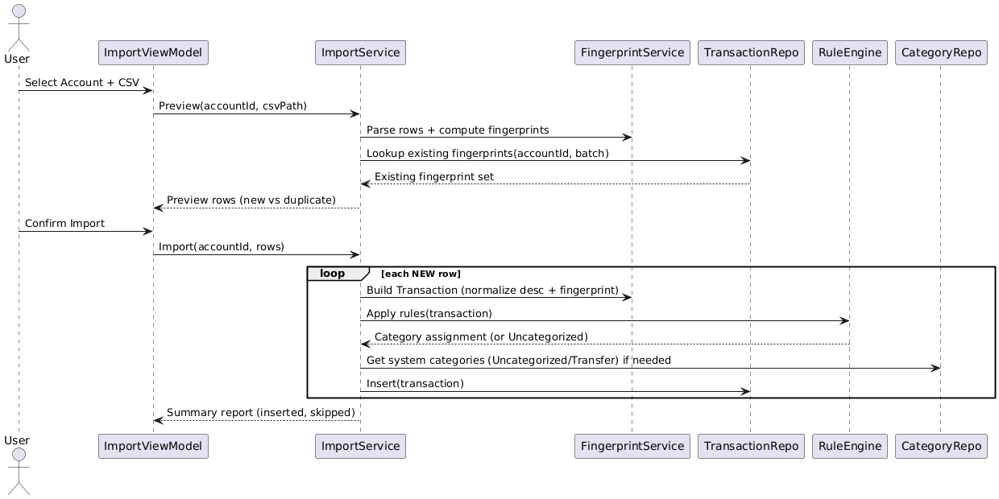
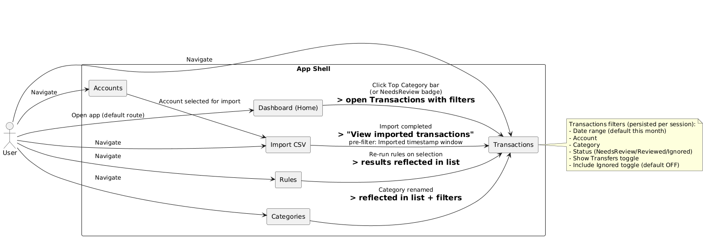
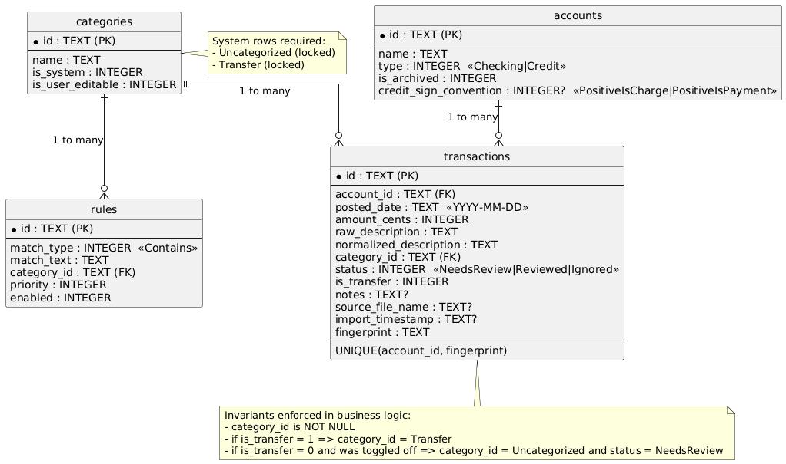

# Expense Tracker — v1 Design Document

**Status:** Approved (Pre-Implementation)  
**Target Platform:** macOS  
**Tech Stack:** C# · .NET · Avalonia UI · SQLite  
**Storage:** Local only (no network access)  

---

## 1. Purpose

This document defines the **authoritative design** for Expense Tracker v1.  
It exists to ensure full clarity and alignment *before* implementation begins.

All implementation decisions **must conform** to this document.  
Any deviation requires an explicit design update.

---

## 2. Product Overview

Expense Tracker is a **local-only desktop application** that allows a single user to:

- Import and manually enter financial transactions
- Categorize transactions efficiently (manual + rules)
- Review exceptions through a clear workflow
- View accurate spending and income dashboards

### Explicit Non-Goals (v1)

The following are intentionally excluded:

- Budgets
- Forecasting
- Bank syncing / APIs
- Mobile support
- Multi-user support
- Cloud storage

---

## 3. Core Principles

1. **Correctness over automation**
2. **Explicit user intent**
3. **No double-counting**
4. **Low daily cognitive overhead**
5. **Lossless data ingestion**
---

## 4. Design at a Glance
Expense Tracker v1 is a **local-only, MVVM-based desktop application** designed around **explicit financial semantics and manual review** rather than automation. The system models **Accounts, Transactions, Categories, and Rules**, with two **non-editable system categories** (Uncategorized and Transfer) used to enforce correctness and prevent double-counting. Raw imported data is stored losslessly, while all reporting and dashboards rely on a **single TransactionClassifier** that determines income, expense, or exclusion based on account type, credit sign convention, transfer status, and review state. Business rules and invariants are enforced in services (not the UI or SQL), ensuring a clear separation of concerns and a stable foundation that the remainder of this document defines in detail.


## 5. Account Semantics

### 5.1 Account Types

- `Checking`
- `Credit`

Multiple accounts are supported.

---

### 5.2 Checking Account Semantics

| Amount Sign | Meaning |
|------------|--------|
| Positive   | Income |
| Negative   | Expense |

---

### 5.3 Credit Account Semantics

Credit card CSVs vary by institution.  
To preserve correctness and flexibility:

- **Raw values are stored exactly as imported**
- Expense semantics are defined per account

#### Credit Sign Convention (Required at Account Creation)

The user must answer:

> “For this credit card account, does a **positive amount** represent:
> - A charge (expense)
> - A payment / credit?”

This choice is stored per account.

```csharp
enum CreditSignConvention
{
    PositiveIsCharge,
    PositiveIsPayment
}
```

## 6. Transfer Semantics (Authoritative)

Transfers are explicitly marked by the user.

### Rules

- IsTransfer = true forces:
     - Category = Transfer

- Transfers are **excluded from**:

    - Spending totals

    - Category totals

    - Income totals

    - Dashboard charts

### Transfer Toggle Behavior
| Action | Result |
|------------|--------|
| Toggle ON	| Category → Transfer |
| Toggle OFF | Category → Uncategorized, Status → NeedsReview

## 7. Categories
### 7.1 System Categories
|Name	| Editable	| Notes |
|-------|-----------|-------|
|Uncategorized	|❌	|Default category|
|Transfer	|❌	|Used only when IsTransfer = true|

### Invariant
Every transaction must always have exactly one category.


CategoryId is **never null**.

## 8. Transaction Status
```csharp
enum TransactionStatus
{
    NeedsReview,
    Reviewed,
    Ignored
}
```

### Ignored Transactions

- Visible in UI

- Hidden by default

- Optional filter: “Include Ignored”

- Do not:

    - Appear in dashboards

    - Contribute to totals

    - Count toward NeedsReview

## 9. Data Model
### 9.1 Account
```csharp
Account
{
    Guid Id
    string Name
    AccountType Type
    bool IsArchived
    CreditSignConvention? CreditSignConvention // credit only
}
```

## 9.2 Category
```csharp
Category
{
    Guid Id
    string Name
    bool IsSystemCategory
    bool IsUserEditable
}
```

### 9.3 Rule
```csharp
Rule
{
    Guid Id
    MatchType MatchType // v1: Contains
    string MatchText
    Guid CategoryId
    int Priority
    bool Enabled
}
```

### 9.4 Transaction
```csharp
Transaction
{
    Guid Id
    Guid AccountId
    Date PostedDate
    long AmountCents

    string RawDescription
    string NormalizedDescription

    Guid CategoryId
    TransactionStatus Status
    bool IsTransfer
    string? Notes

    // Import metadata
    string? SourceFileName
    DateTime? ImportTimestamp
    string Fingerprint
}
```

## 10. Import Design
### 10.1 Import Goals

- Reliable ingestion

- No duplication

- Transparent preview

- Lossless data storage

### 10.2 CSV Import Flow
1. Select account

2. Select CSV

3. Preview mapped rows

4. Deduplicate via fingerprint

5. Import

6. Show summary



### 10.3 De-Duplication
- Fingerprint generated per transaction

- Unique constraint: `(AccountId, Fingerprint)`

- Duplicates are skipped, not overwritten

### 10.4 Default Status Rules
| Condition        | Status      |
| ---------------- | ----------- |
| Auto-categorized | Reviewed    |
| Uncategorized    | NeedsReview |

## 11. Rule Engine
### v1 Rule Type
```
Description contains "TEXT" → Category
```

Rules are:

- Ordered by priority

- Enable / disable

- Optionally re-run on selected transactions


## 12. Reporting & Classification (Authoritative)

All dashboards and totals rely on **one classifier**.

### Classification Rules
```csharp
ClassificationResult Classify(Transaction t, Account account)
{
    if (t.Status == Ignored)
        return None;

    if (t.IsTransfer)
        return None;

    if (account.Type == Checking)
    {
        return t.AmountCents > 0
            ? Income(t.AmountCents)
            : Expense(abs(t.AmountCents));
    }

    // Credit account
    bool isExpense =
        account.CreditSignConvention == PositiveIsCharge
            ? t.AmountCents > 0
            : t.AmountCents < 0;

    return isExpense
        ? Expense(abs(t.AmountCents))
        : None;
}
```

### Invariant
All reporting logic must use TransactionClassifier.
No SQL queries may duplicate classification logic.

## 13. Screens & Responsibilities
### Dashboard

- Monthly spending (this vs last)

- Cash flow trends

- Top categories

- NeedsReview count

- Click-through filtering

### Transactions

- Table view

- Filters: date, account, category, status, transfers, ignored

- Actions:

    - Change category

    - Toggle transfer

    - Mark reviewed / ignored

    - Edit notes

### Import

- CSV preview

- Mapping profiles

- Summary report

### Categories

- CRUD (system categories locked)

### Rules

- Ordered rule list

- Enable / disable

- Optional re-run

### Accounts

- Add/edit

- Type selection

- Credit sign convention

- Archive (optional v1)



## 14. Architecture
### Pattern: MVVM

- Views: Avalonia XAML

- ViewModels: State + Commands

- Services:

    - ImportService

    - RuleEngine

    - TransactionClassifier

    - ReportingService

- Repositories:

    - AccountRepository

    - TransactionRepository

    - CategoryRepository

    - RuleRepository

## 15. Storage
### Database
- SQLite

- Local file only

- Manual backup by copying DB




## 16. Definition of Done (v1)

- Correct import + de-duplication

- Accurate dashboards

- Explicit review workflow

- No double counting

- All invariants enforced